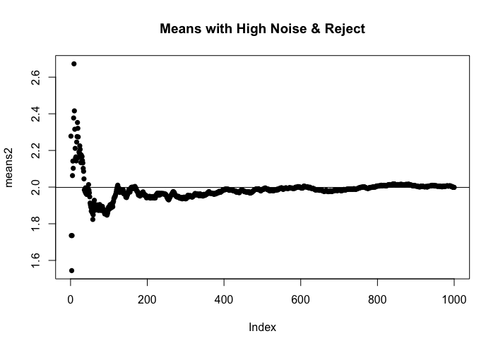

## Stream Normalizing API

This repo contains a [plumber](https://www.rplumber.io/) - based API for R using [Redis](https://redis.io/) and the [redux](https://github.com/richfitz/redux) package to normalize data as it streams (say, from a sensor).

Although the API is *written* in R, it is designed to be used by any type of system that can interface with a RESTful API.

For a discussion on use cases, see "About Normalization" below.

## Prerequisites

The API needs R with a running instance of Redis (for key-value storage across potentially multiple API instances), and uses the environment variables `REDIS_HOSTNAME` and `REDIS_PORT` to know where to "find" your installation of Redis. The entire thing could be packaged in a single Docker container, if desired.

The package also needs plumber and redux, as mentioned above. `install.packages(c('plumber', 'redux'))`

## Getting started
Download this repo, start Redis running, and then set your working directory to where you downloaded the files.

``` {r}
# Assumes you have Redis operating on the local machine on the default port
Sys.setenv(REDIS_PORT=6379)
Sys.setenv(REDIS_HOSTNAME='127.0.0.1')
plumber::plumb(file='main.R')$run(port=8000)
```

By default, plumber APIs launch a Swagger API explorer at the endpoint `/__docs__/` (in this case, `http://127.0.0.1:8000/__docs__/`)


# Standard Parameters
The API has a single endpoint, `getNorm` that expects at a minimum, the parameters `name`, `v`, and `k`.

`name` establishes the name of the series of measurements you are collecting, and permits the normalization of multiple time series fromt he same API.

`v` is the value you measured

`k` is the number of the measurement (its place in the series), and must always start at 1 when you initialize (or reinitialize) a named series, and continue to increment each time - with a few exceptions to be covered later.

When an HTTP POST provides those three values (in the body of the request, encoded as application/json), the API uses Welford's algorithm to calculate a "running standard deviation," and then normalizes the data by subtracting the running mean from the value, and then dividing by the running standard deviation. The API returns the normalized value (`normv`), the next `k` value, the current value of the running mean, `mean`, and the current value of the running standard deviation, `std`.

*NOTE:* for the first 2 values, the standard deviation is undefined by the algorithm, so the API uses an initial guess. If not overridden, the API assumes every series is a *standard normal* (mean of 0, standard deviation of 1).

## Optional Parameters
If you have expectations about the data, you can use your prior knowledge to shape the calculations witht he following parameters:

`m` - initial estimate of mean (optional - defaults to 0 & ignored if K>1)

`std` - initial estimate of the standard deviation (optional - defaults to 1 - ignored if k>1)

`lowthresh` - negative number of standard deviations below 0 to reject (optional - ignored if k<3 or set to 0 (default)). If you expect that the data will occasionally drop far below the mean due to some environmental reason not related to the measurement (loss of data, perhaps), you can reject in the running normalization any values below `lowthresh` from being figured into the running normalization (see discussion below for more insight).

`highthresh`  - number of standard deviations above 0 to reject (optional - ignored if k<3 or set to 0 (default)). If your measurement may periodically jump far above the expected set of values (a sensor that fails as 0xFF instead of 0, for example), you can set a high reject (see discussion below for more insight).

## About Normalization
*CAUTION:* It's beyond the scope of this README to give a lengthy lesson on statistics, but suffice to say, not all types of measurements should be normalized in this way. In general, this type of normalization works best on distributions where values close to the mean are more likely than values far from the mean. Before blindly using this method, you may wish to read about the different types of distributions you may encounter.

### Why Normalize? 
When doing a cross-comparison of different types of measurements (e.g. for a correlation analysis or machine learning algorithm) it's often helpful to scale the values such that the resulting distribution is approximately a _standard normal_ (a Gaussian of mean 0 and standard deviation 1). In this way, a variable that ranges between 1000 and 2000 with a standard deviation of 50 can be compared to one that ranges between -1 and 1 directly without fear that the raw values will overwhelm the relationship.

### Why Normalize While Streaming?
When normalizing a collection of data, if we have _all_ of the points, taking the mean and dividing by the standard deviation is easy, but in many cases, we are exploring in real time. Using only a small sample distribution to normalize may skew our subsequent measurements, and as systems change over time, we want to avoid having to recalibrate (which could require keeping ALL - or a large sample - of the measurements). 

To see an example of how streaming normalization compares to normalization after the fact, launch two different R sessions (in different terminals, or different Rstudio windows). In the first window, set your working directory to wherever you downloaded this repo and configure/launch the API:
``` {r}
# Assumes you have Redis operating on the local machine on the default port - adjust accordingly
Sys.setenv(REDIS_PORT=6379)
Sys.setenv(REDIS_HOSTNAME='127.0.0.1')
plumber::plumb(file='main.R')$run(port=8000)
```

In the second window, try the following code (again, I did this in R, but it could just have easily been done in Python, etc.):
```{r}
library(httr)
x<-rnorm(1000, mean=2, sd=2) # create a random dataset with mean 2, std of 2
host<-'http://127.0.0.1:8000/getNorm'
norm<-NULL
# loop through to simulate streaming this data one value at a time, and retrieve the normalized values
for (n in 1:length(x)){
  bod<-list(name='test2',v=x[n], k=n)
  a<-POST(url=host,body=bod, encode = 'json')
  b<-content(a)
  norm<-c(norm,b$normv[[1]])
}
realnorm<-(x-mean(x))/sd(x) # calculate the normalized data with all points known
plot(norm-realnorm, type='l')
```


As we might expect intuitively, the difference between the streaming normalized values and the "fixed" normalization starts off large, then converges to near zero.

### Thresholding
In some systems, bad data points are expected to occur for reasons outside the control of the experiment. A value might be corrupted or deleted in transit, causing sudden changes in the mean and standard deviation. These deviations, however, are not part of the system being examined, and the inclusion of these outliers can skew our results. 

For example, what if we had a data source that was distributed about a mean of 2 but occasionally had (through a process error) a 10 added to the value?

Leaving the API running, we can simulate this and show the differences by running the following in the other window:
```{r}
library(httr)
x<-rnorm(1000, mean=2, sd=2) 
truemean<-mean(x)
# Now add noise to the data
j<-sample(1:length(x),10)
x[j]<-x[j]+10
host<-'http://127.0.0.1:8000/getNorm'
norm<-NULL
means<-NULL # keep track of the means this time
# For reasons that will become obvious, use k returned from the API each time
k<-1
for (v in x){
  bod<-list(name='test2',v=v, k=k)
  a<-POST(url=host,body=bod, encode = 'json')
  b<-content(a)
  norm<-c(norm,b$normv[[1]])
  means<-c(means,b$mean[[1]]) # Log the mean returned fromt he API
  k<-b$k[[1]] # use the k returned from the API
}
# Plot the normalized data, highlighting the values more than 3.5 sigmas above the running mean
color<-sapply(norm, function(x){switch(EXPR = (x>3.5)+1, 'blue','red')})
plot(norm, col=color, pch=16, type='b')
```


The noise is evident - but perhaps not by as many sigmas (standard deviations) as we might expect. Plotting the running mean shows what effect the noise is having:

```{r}
plot(means, pch=16, main='Means with High Noise & No Reject')
abline(h=truemean)
```


The noise is shifting the mean higher than the true mean of our data.

If we know this about our system, we can set a high threshold to reject statistically unlikely values - for the sake of clarity, we'll say anything more than 3.5 standard deviations.

```{r}
norm2<-NULL
means2<-NULL # keep track of the means this time
# For reasons that will become obvious, use k returned from the API each time
k<-1
for (v in x){
  bod<-list(name='test2',v=v, k=k)
  a<-POST(url=host,body=bod, encode = 'json', highthresh=3.5) # add the highthresh parameter
  b<-content(a)
  norm2<-c(norm2,b$normv[[1]])
  means2<-c(means2,b$mean[[1]]) # Log the mean returned fromt he API
  k<-b$k[[1]] # use the k returned from the API
}
# Plot the normalized data, highlighting the values more than 3.5 sigmas above the running mean
color<-sapply(norm2, function(x){switch(EXPR = (x>3.5)+1, 'blue','red')})
plot(norm2, col=color, pch=16, type='b')
```


Now notice how our running mean "repairs itself" by rejecting the extreme values:

```{r}
plot(means2, pch=16, main='Means with High Noise & Reject')
abline(h=truemean)
```


We might have done the same for lost values being filled in with "0" by setting a low threshold. It won't work in every situation, but depending on the situation, the API can "learn" the best representation of the distribution of streaming data without post-hoc analysis on massive datasets.

